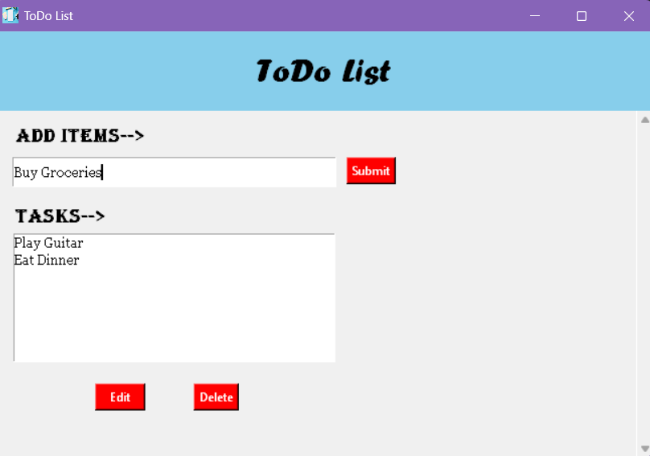

# 📝 Task 1: To-Do List GUI
**A Python-based task management application featuring a clean Graphical User Interface (GUI).**

# 📌 Project Architecture
This application serves as a functional utility for personal productivity, transitioning from basic CLI logic to a robust event-driven Graphical User Interface. Developed as part of the CodSoft Python Development Internship, the project emphasizes clean code structure and responsive UI design.

# 🛠️ Technical Stack
**Language:** Python 3.14.3

**Library:** tkinter (Standard Python Interface to Tcl/Tk)

**Imaging:** Pillow (PIL Fork) for advanced raster image processing and icon integration.

**Environment:** Visual Studio Code on Windows 11.

# 🌟 Key Features 
**Event-Driven Interaction:** Utilizes a main event loop to handle real-time user inputs and button triggers.

**Dynamic List Management:** Implements full CRUD (Create, Read, Update, Delete) functionality for task entries.

**Asset Integration:** Features custom branding and icon support managed through the PIL library to ensure cross-format compatibility.

**Scalable Logic:** Designed with modularity in mind, allowing for future integration with SQLite or JSON for persistent data storage.

# ⚖️ Professional & Ethical Standards
**Digital Accessibility:** High-contrast UI elements and clear typography for enhanced readability.

**Robust Error Handling:** Integrated exception handling for resource loading to ensure application stability across different environments.

**Privacy by Design:** Local execution ensures no user data is transmitted or stored externally without explicit consent.

---
*Developed by Sohini | March 2026*