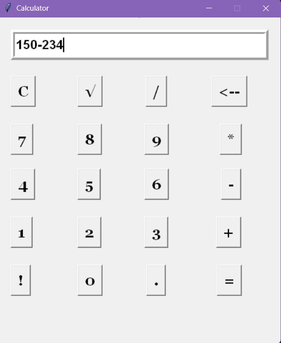

🔢 Task 2: Robust Arithmetic Calculator
A high-precision desktop calculator featuring a Graphical User Interface for seamless mathematical operations.

📌 Project Architecture
This application is designed to handle standard arithmetic and scientific operations through a responsive Tkinter-based interface. The project emphasizes efficient string parsing and mathematical logic, developed as the second milestone of the CodSoft Python Development Internship.

🛠️ Technical Stack
Language: Python 3.x

Core Libraries: tkinter for UI rendering and math for advanced operations (Square Root).

Logic Engine: Utilizes the dynamic eval() function for real-time expression evaluation and string manipulation for backspace functionality.

Environment: Visual Studio Code on Windows 11.

🌟 Key Features
Dynamic Expression Parsing: Supports complex multi-operator strings (Addition, Subtraction, Multiplication, Division).

Scientific Operations: Integrated math.sqrt() functionality for high-precision root calculations.

Responsive Grid Layout: Precise coordinate-based placement of widgets ensures a consistent user experience on Windows displays.

Input Sanitization: Includes a "Clear" (C) function to reset the state and a custom backspace (<--) logic using Python string slicing.

⚖️ Technical Standards & Design Philosophy
Reflecting a dual focus on Engineering and Law, this project prioritizes:

Precision and Reliability: Ensuring mathematical accuracy by leveraging Python’s built-in floating-point arithmetic.

UX Integrity: A fixed-geometry window (464x538) prevents layout breakage, ensuring that the interface remains professional and predictable for the end-user.

Clean State Management: Utilizes StringVar() for synchronized data binding between the logic and the UI entry field.

Developed by Sohini | March 2026