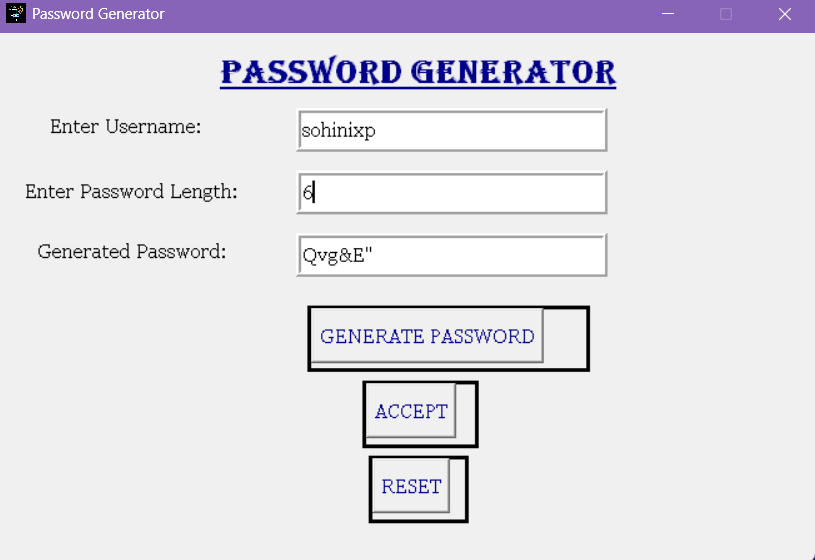

🔐 Task 3: Secure Password Generator
A cryptographic utility designed to generate complex, randomized strings for enhanced user security and data protection.

📌 Project Architecture
This application provides a secure method for generating high-entropy passwords based on user-defined length requirements. Developed as the third milestone of the CodSoft Python Development Internship, the project focuses on utilizing Python’s randomization modules to create strings that are resistant to brute-force attacks.

🛠️ Technical Stack
Language: Python 3.x

Core Libraries: tkinter for UI, random for selection logic, and string for character set aggregation.

Logic Engine: Employs random.sample() to ensure unique character selection from a combined pool of ASCII letters, digits, and punctuation marks.

Environment: Visual Studio Code on Windows 11.

🌟 Key Features
Custom Complexity: Combines uppercase, lowercase, numerical, and special characters (string.punctuation) to meet modern security standards.

Dynamic Length Control: Users can specify the exact number of characters to be generated, allowing for flexibility across different platform requirements.

Multi-State Management: Features dedicated functions for Generation, Acceptance (clearing inputs for new sessions), and Resetting states.

Fixed Geometry UI: A non-resizable 655x423 layout ensures visual consistency and prevents widget displacement.

⚖️ Security & Professional Integrity
Given the intersection of Computer Science and Legal Studies, this project highlights:

Data Privacy: All password generation occurs locally in the system's memory; no data is logged or transmitted, adhering to fundamental privacy principles.

Entropy Standards: By including punctuation and digits by default, the generator encourages users to move away from predictable, low-entropy credentials.

User-Centric Design: The interface provides a clear separation between user identification and credential generation, mimicking professional enterprise tools.

Developed by Sohini | March 2026